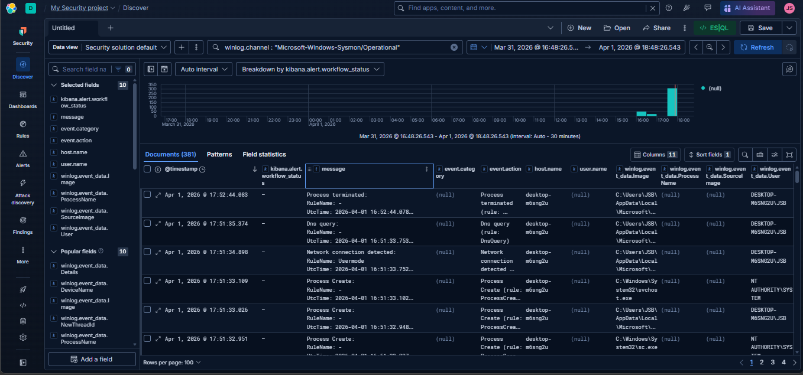
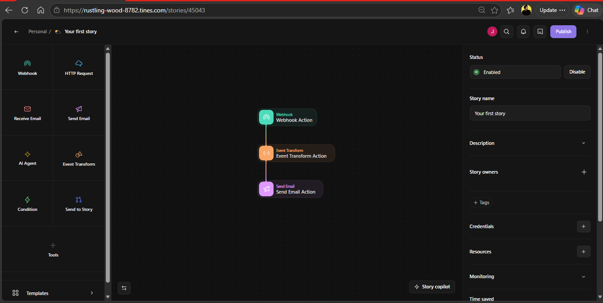
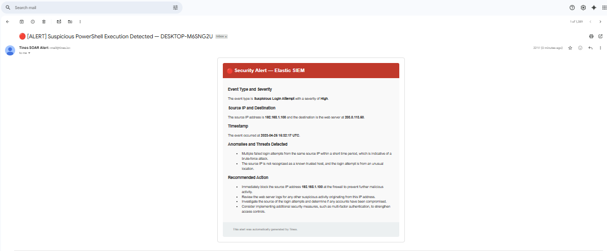

# 🛡️ AI-Powered SOC Automation: Intelligent Threat Detection & Response

## 📖 Project Overview
This project demonstrates a Next-Generation SOC Pipeline designed to bridge the gap between detection and action. By integrating **Elastic SIEM** with **Tines AI-Driven SOAR**, I built a system that identifies suspicious PowerShell activity on a Windows endpoint, decodes obfuscated commands in real-time, and alerts security analysts via automated email.

The pipeline monitors for **Encoded PowerShell Execution (MITRE T1059.001)**. Upon detection, an **AI-augmented workflow** intercepts the telemetry, decodes the hidden payload, and delivers a structured incident report.

---

## 🤖 The "AI Edge"
Unlike legacy automation that relies on static scripts, this project utilizes **Tines AI/Automatic Agents** to handle complex data:
* **Intelligent Parsing:** The system adapts to varying JSON schemas from Elastic Webhooks without manual re-mapping.
* **Automated De-obfuscation:** AI logic identifies the encoding type (Base64) and translates "attacker gibberish" into human-readable commands for immediate triage.
* **Reduced MTTR:** Automating the decoding phase reduces the time between "Alert Triggered" and "Analyst Review" from minutes to seconds.

---

## 🛠️ Technical Stack
* **SIEM:** Elastic Stack (Cloud)
* **SOAR:** Tines (AI-Powered)
* **Endpoint:** Windows 10 VM
* **Telemetry:** Sysmon & Elastic Agent
* **Frameworks:** MITRE ATT&CK

---

* ## 🛡️ MITRE ATT&CK Mapping
| Tactic | Technique | ID |
| :--- | :--- | :--- |
| **Execution** | Command and Scripting Interpreter: PowerShell | **T1059.001** |
| **Defense Evasion** | Obfuscated Files or Information | **T1027** |

---

## 🚀 How it Works
1.  **Detection:** A malicious encoded PowerShell command is executed on the Windows endpoint.
2.  **Alerting:** Elastic SIEM identifies the `-EncodedCommand` flag and triggers a high-severity alert.
3.  **Automation:** Tines receives the alert via Webhook. The **AI-Powered Event Transform** extracts critical metadata (Hostname, User, Command).
4.  **Enrichment:** The SOAR platform decodes the Base64 command on-the-fly.
5.  **Response:** A comprehensive SOC report is emailed to the analyst, providing the "True Intent" of the execution.

---
## 📊 Proof of Concept

### 1. Elastic SIEM Logs

*Figure 1: Analyzing Sysmon Events for PowerShell Obfuscation.*

### 2. Tines AI Workflow

*Figure 2: The automated flow logic using AI-powered transformation nodes.*

### 3. Final Decoded Alert Email

*Figure 3: The automated incident report with the decoded command and analysis.*

---

## 📂 Repository Contents
* `/config`: Contains the **Elastic Rule (NDJSON)** and **Tines Storyboard (JSON)** exports.
* `/images`: Screenshots of the lab in action.

